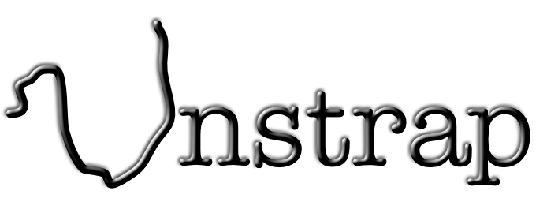

The Unstrap component is a very lightweight JavaScript component. It is made for modern ES6 JavaScript, so the a component can be publish at NPM and imported in a JavaScript project that is build by a build tool like Webpack or Rollup. An Unstrap component can be created in many ways, depending on programming habits, but a few conventions have to be followed. Let us create an example and explain along the way.

A component has to export this structure.

```js
{
	name: String,
	selectors: [ String.. ] //optional
	extend: Function, //optional
	render: Function,
}
```

### name

The name of the component is important not just for identification, but unless there are selectors (explained later), the name will be used as a CSS selector for the component. Say that `name: 'my-component'`, then a user of it can write HTML elements like `<my-component/>`. The name of the component has then to be a valid HTML element name, but unique among elements and components.

### selectors

An array of CSS selectors to identify the particular component. A class will be written with a period in front of the name, like `.comp-name`, an element name without the period, and so on. There can be several reasons to use several selectors, but let's not go there now. The "selectors" property can be omitted.

### extend

The extend function will be called by the component itself, when the component is created. It has the root element of the component as the only parameter, and the purpose is to build up the complete internal structure of the component with JavaScript. It is optional, but most components will have it, unless it is very simple component with just CSS styling.

### render

The render function is made for creating the component by JavaScript. It has to return an element that can be placed on a web page programatically. The result should be the same as if the component was places as HTML.

## Example: Count-Box

Here is a silly example of a component to show the different parts. I places a text on the page that looks like this: "Counted to 1". It has a counter that will automatically increase the number. The text color can be changed and it is possible to make it clickable. Totally meaningless, but good for illustration. This is the JavaScript code:

```js
import unstrap from "@unstrap/unstrap";
import "./count-box.css";

function counter () {
	let n = 1;
	return () => n++;
}

let c = counter();

let countBox = {
	name: 'count-box',

	extend: (elem) => {
		if (elem.attributes.color) {
			elem.style.color = elem.attributes.color.value;
		}
		if (elem.attributes.onclick) {
			elem.addEventListener('click', window[elem.attributes.onclick.value]);
			elem.classList.add('clickable');
		}
		let h1 = document.createElement('h1');
		h1.appendChild(document.createTextNode('Counted to ' + c()));
		elem.appendChild(h1);
	},

	render: (props) => {
		props = props || {};
		var box = document.createElement('count-box');
		props.onclick && (box.addEventListener('click', props.onclick), box.classList.add('clickable'));
		props.color && (box.style.color = props.color);
		return box;
	}
}

unstrap.register(countBox);

export default countBox;
```

First to mention is that "unstrap" is imported. The component will register itself to it. This means that the "unstrap" module will find all new elements with the right selector, and send it to the component's extend function.

The CSS code for the component is also imported. This is by use of the module "postcss", that should be used as a plugin in the build tool. Other solutions are indeed possible, but this is the preferred way.

The "counter" function is just a clousure to count how many times the component is used.

The "countBox" is the exported object with the properties mentioned. Here no "selectors" is used, just the "name". The "extend" property is a function that extends the element it is given. It looks for the attributes "color" and "onclick", and applies them if they exist. It also creates a child element "H1" with text and a number from the counter. Finally the "render" function will create the component's root element and return it. The attributes can't be used, so a "props" parameter is used instead. The "extend" function will automatically be called, so everything else is done there.

The CSS is simple in this component:

```css
count-box {
	font-size: x-large;
}

count-box.clickable {
	cursor: pointer;
}
```

After building and packing the code into "bundle.js", the component can be used on a HTML page: 


```html
<!doctype html>
<html lang="en">
  <head>
    <title>Unstrap component</title>
    <meta charset="utf-8"></meta>
    <script src="bundle.js"></script>
    <script>
    	function click () {
    		console.log('got clicked')
    	}
    </script>
  </head>
  <body>
  	<count-box color="gold"/>
  	<count-box color="black" onclick="click" />
  </body>
</html>
```

Writing HTML is just one way of using the component. It can also be used from within JavaScript. Here an example with ["tripledollar"](https://tripledollar.net).


```js
import $$$ from "tripledollar";
import cb from './count-box.js';
import './main.css';

$$$.appendToDoc(['div.center',
	['h1', 'Unstrap Component Demo'],
	['count-box', {color: 'red'}],
	['count-box'],
	['count-box', {color: 'blue'}],
	cb.render({onclick: () => {console.log('Hello')}}),
	cb.render({onclick: () => {console.log('Goodbye')}, color: 'green'})
]);
```

"Tripledollar" is mainly a module to help create DOM structures with less code. In this example the code places five "count-box" on the page, both as elements directly, and with use of the "render" function.


## Variants

To alter the "count-box" above without changing it's code, we can create our own variant. Here we let the "extend" function of the original component do it's job, then we add our own stuff. This will give us a variant with it's own name "my-variant-box", coexisting with the original "count-box".

```js
import $$$ from "tripledollar";
import unstrap from "@unstrap/unstrap";
import countBox from "./count-box.js";

function render () {
	return $$$('my-variant-box');
}

let aVariantBox = {
	name: "my-variant-box",

	extend: (elem) => {
		countBox.extend(elem);
		$$$(elem).ins(['p', 'This is a variant.']);
	},

	render: render
}

unstrap.register(aVariantBox);

export default aVariantBox;
```

## How to begin

You need Nodejs istalled, then from the prompt in an empty folder run these commands:

```sh
npx tripledollar --init
npm install
npm install @unstrap/unstrap --save
npm run build
```

Make your own component and change "main.js" to include it, similar to this:

```js
import $$$ from "tripledollar";
import './main.css';
import cb from './count-box.js';

$$$.appendToDoc(['div.center',
	['h1.tripledollar', 'Count-Box Demo'],
	['p.version', 'Version ', $$$.version],
	['count-box'],
	['count-box', {color: 'red'}],
	cb.render({onclick: () => {console.log('svejsan')}, color: 'green'})
]);
```


